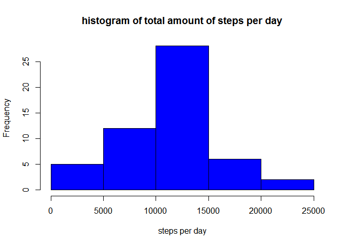
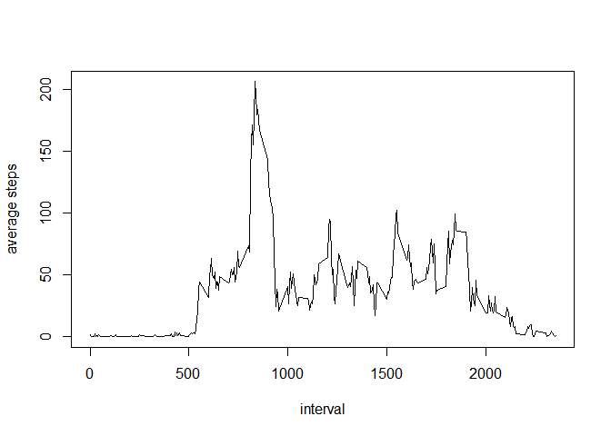
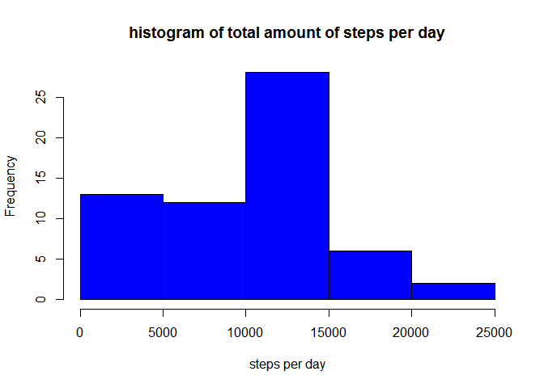
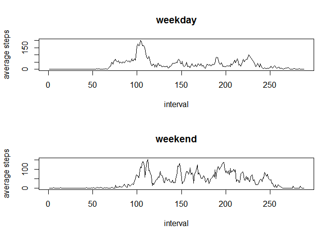

# Reproducible Research: Peer Assessment 1

---

## 1. Loading and preprocessing the data
Data were loaded from **"activity.csv"** file using the following code:


```r
DATA<-read.csv("activity.csv", colClass=c("numeric","Date","numeric"))
names(DATA)
```

```
## [1] "steps"    "date"     "interval"
```

## 2. What is mean total number of steps taken per day?
#### 1. Make a histogram of the total number of steps taken each day


```r
#remove intervals with 'NA' steps
data<-subset(DATA, steps!="NA");

# calculate total steps per day
data_sum<-tapply(data$steps,data$date,sum);

# create histogram
png(filename = "histplot_1.png",width = 480, height = 480)
hist(data_sum, xlab= "steps per day", main="histogram of total amount of steps per day",col="blue")
dev.off()

hist(data_sum, xlab= "steps per day", main="histogram of total amount of steps per day",col="blue")
```

 

#### 2. Calculate and report the mean and median total number of steps taken per day


```r
average <- mean(data_sum)
median  <- median(data_sum)
```
**The mean** total number of steps taken per day is: **1.0766 &times; 10<sup>4</sup>** steps. 

**The median** total number of steps taken per day is: **1.0765 &times; 10<sup>4</sup>** steps. 


## 3. What is the average daily activity pattern?

#### 1. Make a time series plot of the 5-minute interval (x-axis) and the average number of steps taken, averaged across all days (y-axis)

```r
data_mean<-tapply(data$steps,data$interval,mean)
data_intervals<-unique(data$interval)
png(filename = "timeseriesplot_1.png",width = 480, height = 480)
plot(data_intervals,data_mean,xlab="interval",ylab="average steps",type="l")
dev.off()
plot(data_intervals,data_mean,xlab="interval",ylab="average steps",type="l")
```

 

#### 2. Which 5-minute interval, on average across all the days in the dataset, contains the maximum number of steps?

```r
idx<-which(data_mean==max(data_mean))
interval_max_steps<-data_intervals[idx]
```
The **835** interval on average across all the days contains the maximum number of steps.

## 4. Imputing missing values

#### 1. Calculate and report the total number of missing values in the dataset (i.e. the total number of rows with NAs)

```r
# row index were any variable in column is NA
na_idx <- which(is.na(DATA$steps));
na_amount<-length(na_idx)
```
The total number of missing values in the dataset is **2304**. 

#### 2. Devise a strategy for filling in all of the missing values in the dataset. 

3. Create a new dataset that is equal to the original dataset but with the missing data filled in.

```r
data<-DATA
# fill the missing 'steps' with median value for each interval
data[na_idx,1]<-median(data$steps,na.rm = TRUE)
```

#### 4. Make a histogram of the total number of steps taken each day and calculate and report the mean and median total number of steps taken per day. Do these values differ from the estimates from the first part of the assignment? What is the impact of imputing missing data on the estimates of the total daily number of steps?


```r
# calculate total steps per day
data_sum<-tapply(data$steps,data$date,sum);

# create histogram
png(filename = "histplot_2.png",width = 480, height = 480)
hist(data_sum, xlab= "steps per day", main="histogram of total amount of steps per day",col="blue")
dev.off()

hist(data_sum, xlab= "steps per day", main="histogram of total amount of steps per day",col="blue")
```

 

```r
# calculate average and mean
average_na <- mean(data_sum)
median_na  <- median(data_sum)

diff_average<-abs(average_na-average)
diff_median<-abs(median_na-median)
```

**The mean** total number of steps taken per day is: **9354.2295** steps. 

**The median** total number of steps taken per day is: **1.0395 &times; 10<sup>4</sup>** steps. 

The difference in average estimator is **1411.9592** and in median estimator is **370**. The impact of imputing missing data make median and mean value smaller. Imputing missing data do not change distribiution type.


## 5. Are there differences in activity patterns between weekdays and weekends?

#### 1. Create a new factor variable in the dataset with two levels – “weekday” and “weekend” indicating whether a given date is a weekday or weekend day.

```r
# change LC_time properties
Sys.setlocale("LC_TIME", "English")
data$day<-weekdays(data$date)

weekend<-which(data$day=="Saturday" | data$day=="Sunday")
data[weekend,4]<-"weekend"

weekday<-which(data$day=="Monday" | data$day=="Tuesday" | data$day=="Wednesday" 
               | data$day=="Thursday" | data$day=="Friday")
data[weekday,4]<-"weekday"

data$day<-factor(data$day)
```


#### 2. Make a panel plot containing a time series plot (i.e. type = "l") of the 5-minute interval (x-axis) and the average number of steps taken, averaged across all weekday days or weekend days (y-axis).

```r
data_weekday<- subset(data,data$day=="weekday")
data_weekend<- subset(data,data$day=="weekend")

png(filename = "panelplot.png",width = 480, height = 480)

par(mfrow=c(2,1))

data_mean<-tapply(data_weekday$steps,data_weekday$interval,mean)
data_intervals<-1:length(data_mean)
plot(data_intervals,data_mean,xlab="interval",ylab="average steps",type="l", main="weekday")

data_mean<-tapply(data_weekend$steps,data_weekend$interval,mean)
data_intervals<-1:length(data_mean)
plot(data_intervals,data_mean,xlab="interval",ylab="average steps",type="l", main="weekend")

dev.off()


par(mfrow=c(2,1))

data_mean<-tapply(data_weekday$steps,data_weekday$interval,mean)
data_intervals<-1:length(data_mean)
plot(data_intervals,data_mean,xlab="interval",ylab="average steps",type="l", main="weekday")

data_mean<-tapply(data_weekend$steps,data_weekend$interval,mean)
data_intervals<-1:length(data_mean)
plot(data_intervals,data_mean,xlab="interval",ylab="average steps",type="l", main="weekend")
```

 


